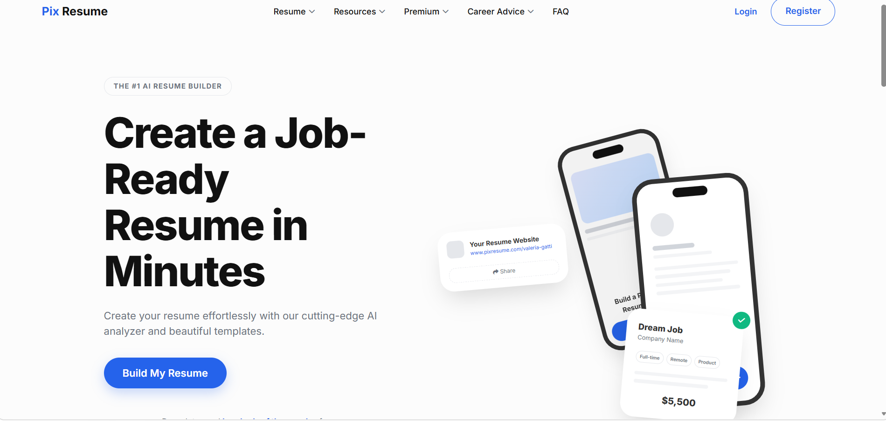

# 📄 Resume Analyzer

A web application that analyzes resumes and provides feedback based on skills and keywords.

---

## 🚀 Features
- Upload Resume (PDF)
- Extract text from resume
- Match skills
- Show score and suggestions

---

## 🛠️ Tech Stack
- Python
- Flask
- HTML, CSS
- PyPDF2

---

## 📂 Project Structure
- app.py
- templates/
- static/
- requirements.txt

---

## ▶️ How to Run

1. Install dependencies
   pip install -r requirements.txt

2. Run the app

python app.py

3. Open browser:

http://127.0.0.1:5000

---

## 💡 Future Improvements
- Add AI-based scoring
- Improve UI
- Add login system

---

⭐ If you like this project, give a star!
